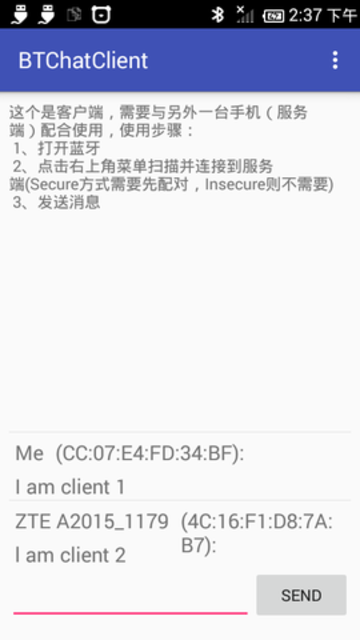
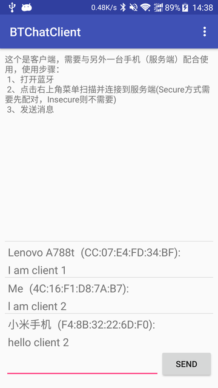
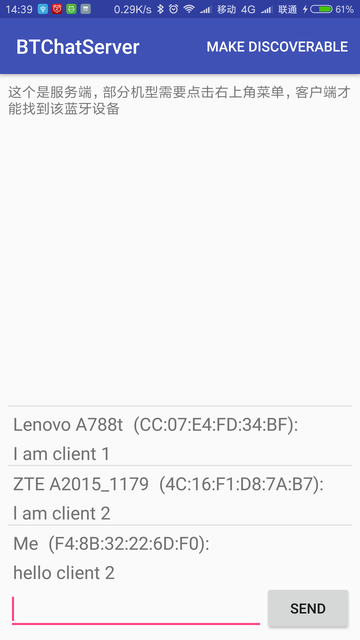

# BluetoothChat_one2more
一对多蓝牙连接示例，基于[Google BluetoothChat](https://github.com/googlesamples/android-BluetoothChat)修改，实现一对多聊天（一个服务端、多个客户端），类似聊天室。

##### 主要功能：
1. 客户端的发出的消息所有终端都能收到(由服务端转发)
2. 客户端之间不能私聊
3. 服务端可以与选定的客户端私聊
4. 服务端可以踢出某个客户端（发送kill消息）

##### 针对原Google BluetoothChat主要修改如下：
1. 将原来一个APP拆分为两个，更有利于了解蓝牙通信
2. 修正搜索设备时，列表有时会重复显示的问题
3. 为了实现服务器转发各个客户端的消息，由原来直接转发byte改为用JSON封装后再转换为byte
4. 由原来只支持一个客户端与服务器连接，改为支持多个客户端连接

##### 项目配置
compileSdkVersion、buildToolsVersion等参数如需修改，请打开根项目的build.gradle修改
``` groovy
ext {
    compileSdkVersion = 27
    buildToolsVersion = "27.0.2"
    minSdkVersion = 18
    targetSdkVersion = 26
    supportLibraryVersion = "26.1.0"
}
```

# bluetoothChatClient
客户端APP，与服务端连接后，可以给服务端发消息
> Android 6.0以上扫描蓝牙设备需要定位权限，弹出权限请求时请允许，否则搜索不到蓝牙设备

# bluetoothChatServer
服务端APP，等待客户端连接
- 接收并显示所有客户端的消息
- 将某个客户端的消息转发给其他客户端
- 可以选择单个客户端(点击聊天记录中的客户端)回复消息，仅选择的客户端可以收到回复
- 选择客户端后，发送kill消息踢人

# bluetoothChatCore
bluetoothChatClient、bluetoothChatServer两个APP共用的部分

# Screenshots
#### client
##### left is client1,right is client 2
&nbsp;&nbsp;

#### server

